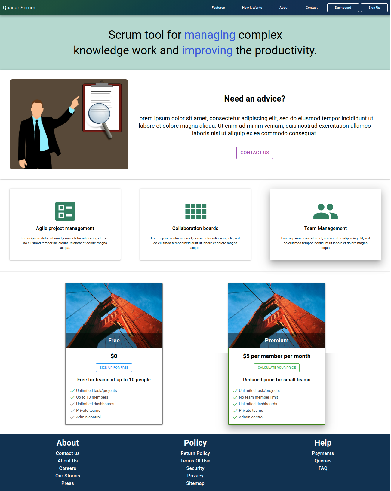

# Quasar Scrum

Quasar Scrum - Agile process framework for managing complex tasks

Few Features:
* Dashboard
* Taskboard Grid View
* Taskboard List View
* Homepage with basic details, pricing

## Site: [https://quasar-scrum.netlify.com/](https://quasar-scrum.netlify.com/)

# Support

If this project helped you, feel free to contribute to its development or reach out for collaboration. Your feedback and contributions are always welcome as we continue to improve this Agile tool.

Thank you very much!

## Resources used
* [Quasar Framework](https://quasar.dev/)
* [Vue.js](https://vuejs.org/)

## Installation

* **Clone the repository**

```
git clone https://github.com/lavanyatadisina/quasar-scrum.git
```

## Install the dependencies
```bash
cd quasar-scrum
npm install
```

### To run the app in development mode (hot-code reloading, error reporting, etc.)
```bash
quasar dev
```


### Build the application
```bash
quasar build
```

Do reach out to me at "tadisinalavanya@gmail.com" for queries.

## Screens UI
**Dashboard Home**
<p float="left">
        <kbd>

                </kbd>
</p>

**Grid View**
<p float="left">
	<kbd>

		</kbd>
</p>

**List View**
<p float="left">
	<kbd>

	</kbd>
</p>

**Homepage**
<p float="left">
	<kbd>
	
	</kbd>
</p>

### Customize the configuration
See [Configuring quasar.conf.js](https://quasar.dev/quasar-cli/quasar-conf-js).

## License

[MIT](http://opensource.org/licenses/MIT)

## About the Maintainer

**Lavanya Tadisina** is a Business Analyst with over 4 years of experience in delivering business analysis, requirements management, and data-driven solutions. This project is maintained to support Agile/Scrum methodologies and streamline process optimization within enterprise IT environments.

* **Title:** Business Analyst
* **Email:** tadisinalavanya@gmail.com
* **Core Expertise:** SQL, Agile/Scrum, Requirements Management, and Process Mapping.

Building upon the original framework, this repository serves as a resource for teams looking to implement efficient task management and workflow analysis.